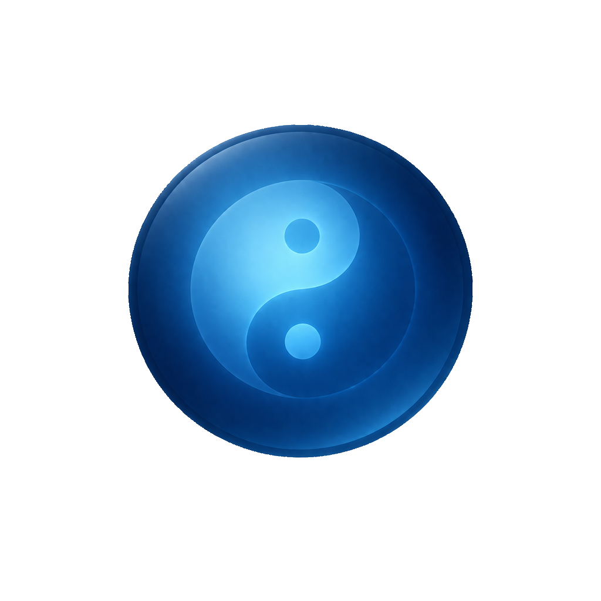

<p align="center">
  
</p>

# Notizen v2

A note taking app with extensible tagging components.

The idea behind Notizen is to be able to take notes and tag them with different tags like:

- **Time** — Displays an editable hour that defaults to the current hour. Common uses include tracking development by time, or planning a day (like an agenda).
- **Color** — Tags each note by a different color so as to organize them.
- **Checkbox** — For items that you may want to mark as completed.

...and you can create your own very easily!

## Tech Stack

- **React 19** with TypeScript
- **Vite** for build tooling
- **Tailwind CSS v4** for styling
- **shadcn/ui** for UI components
- **Lucide React** for icons
- **ESLint 9** (flat config) + **Prettier** for code quality

## Getting Started

```bash
bun install
bun dev
```

## Scripts

- `bun dev` — Start dev server with HMR
- `bun run build` — Type-check and build for production
- `bun run preview` — Preview production build
- `bun lint` — Run ESLint
- `bun format` — Format code with Prettier
